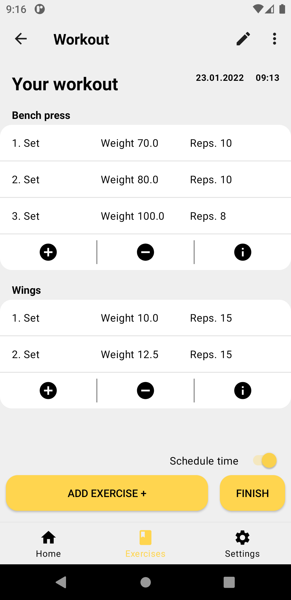
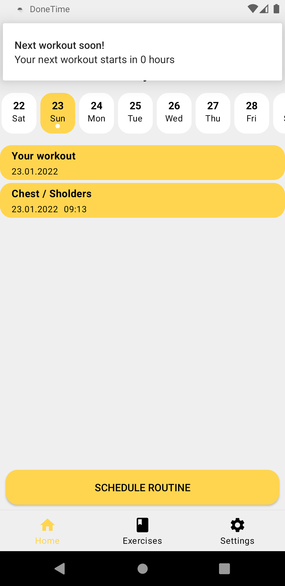
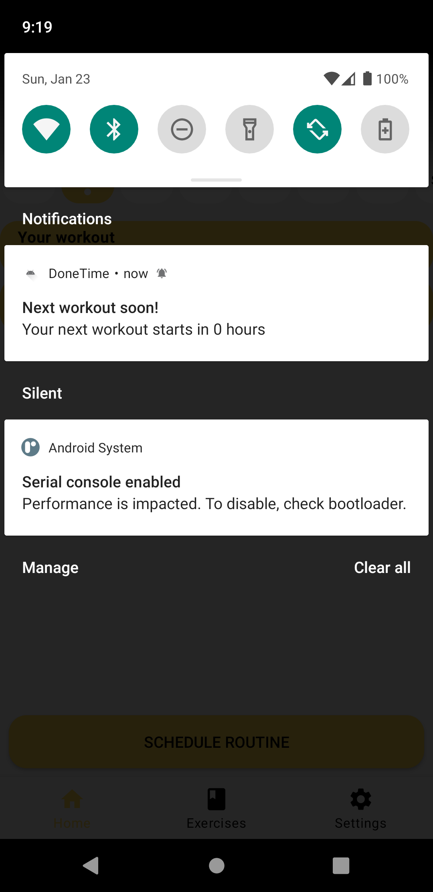
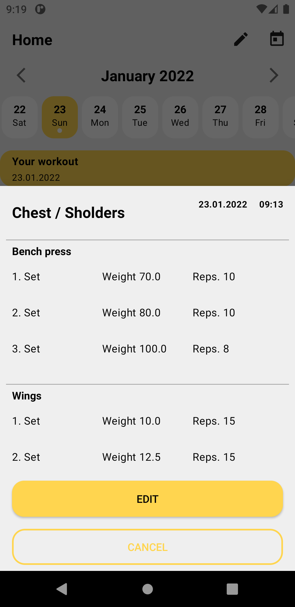
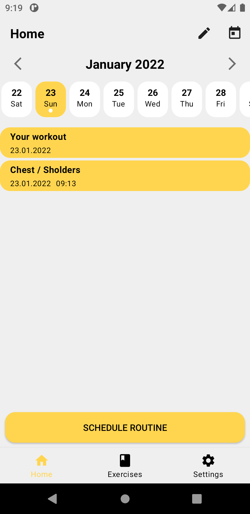
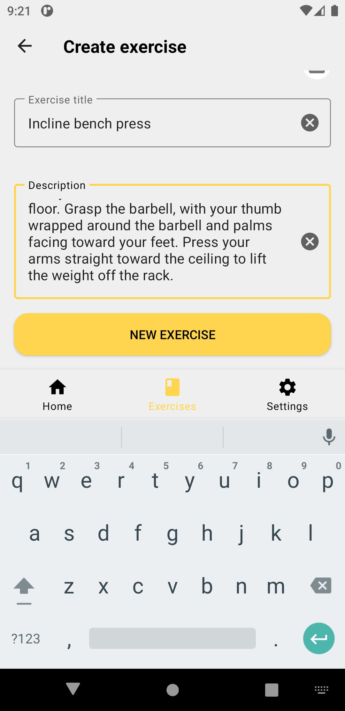
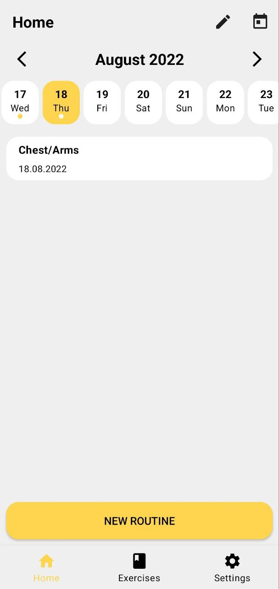
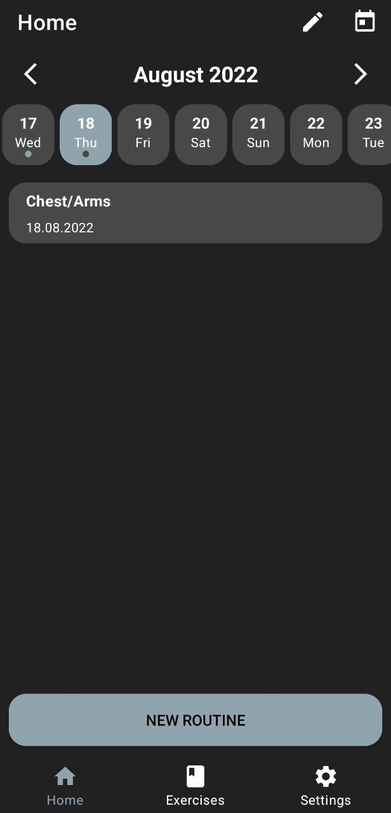

<h1 align="center">Gym Supportrer</h1>

<p align="center">
  <a href="https://opensource.org/licenses/Apache-2.0"></a>
  <a href="https://android-arsenal.com/api?level=21"></a>
  <a href="https://github.com/LeFarmico"></a>
</p>
  
Gym Supporter is a simple tracker of workout activities. You can schedule your routines and get notifications before it starts. Also, you can make your own exercises and simply add them to your routine.


Last version: [Gym supporter](https://drive.google.com/file/d/1Cad4L5fsrcxBl0hJb58z2lBlTClnBI1o/view?usp=sharing)

## Tech stack
- [Kotlin](https://kotlinlang.org/) main language.
- [RxJava](https://github.com/ReactiveX/RxJava) for asynchronous.
- Android Architecture Components.
    - MVI Architecture (Model - View - Intent).
    - Repository Pattern.
    - View Binding.
- [Dagger 2](https://dagger.dev/) for dependecny injection.
- [Firebase Crashlytics](https://firebase.google.com/docs/crashlytics/) - Remote crash control.
- [Room](https://developer.android.com/jetpack/androidx/releases/room) - abstraction over SQLite.
- Jetpack Navigation - Navigation between components by using navigation controller.
- Features.
    - Multi module - The app uses multi module structure to reduce build time.
    - Notifications with BroadcastReceiver.
    - RecyclerView, DiffUtils with Payloads for scrollable screens.
    - [Gradle](https://gradle.org/) by using [Kotlin](https://kotlinlang.org/) language.  
    - Dark Theme - Aslo supports Light Theme and System Default. 

# Architecture
## MVI
<p align="center">

</p>

This App uses MVI (Model - View - Intent) Architecture pattern which helps to control data flow and uses SST (Single Source of Truth). That helps to make clean testable code and use observer patterns to provide data to views. <br />

## Module dependencies
<p align="center">

</p>

# Features
## Schedule routines
You can create your personal routine with your own exercises. Besides you can schedule the time to remind before the workout.

<p align="center">

</p>

## Workout remind
You can create reminders of the next workout to get a notification before a few hours or a day (depends on settings).

<p align="center">
  
</p>
    
## Workout calendar
You can observe your next or last workouts with a calendar.

<p align="center">

</p>

## Create your own exercises
You can create own Category -> Subcategory -> Exercise.

<p align="center">
 
</p>

## Dark Theme
<p align="center">
 
</p>

## Do you like what i do? 🤟
[Follow me](https://github.com/LeFarmico) on GitHub. 😻 <br />
Also press ⭐ and add me on [Linkedin](https://www.linkedin.com/in/artsiom-zharnikovich-46726b1b5/).

# License

```
Copyright 2022 LeFarmico (Artsiom Zharnikovich)

Licensed under the Apache License, Version 2.0 (the "License");
you may not use this file except in compliance with the License.
You may obtain a copy of the License at

    http://www.apache.org/licenses/LICENSE-2.0

Unless required by applicable law or agreed to in writing, software
distributed under the License is distributed on an "AS IS" BASIS,
WITHOUT WARRANTIES OR CONDITIONS OF ANY KIND, either express or implied.
See the License for the specific language governing permissions and
limitations under the License.
```
